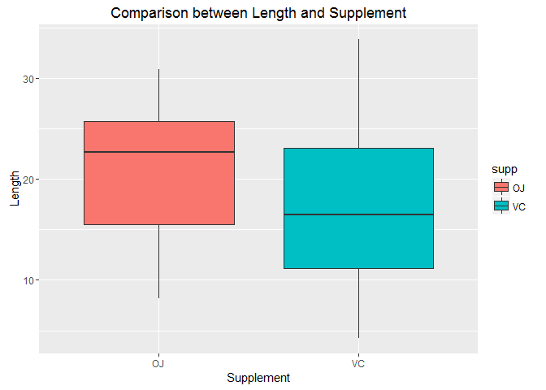
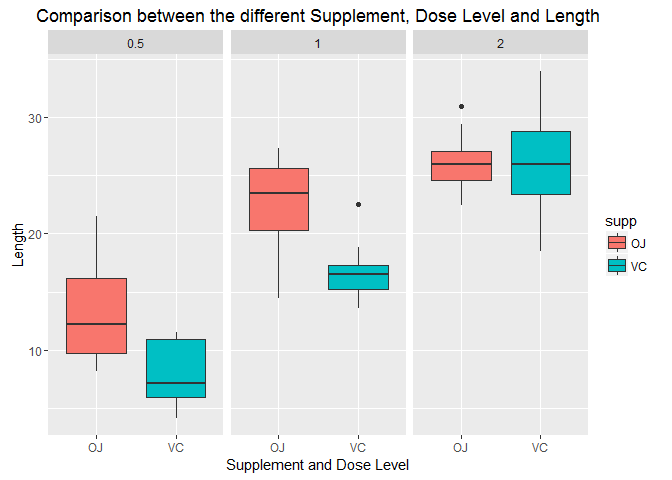

# Statistical Inference Part 2
Swee Yean  
July 21, 2016  
##Statistical Inference Project 2 on Tooth Growth##


In this Assignment part 2, we analyze the ToothGrowth data in the R datasets package. The response is the length of odontoblasts (cells responsible for tooth growth) in 60 guinea pigs, each receiving one of three dose levels of Vitamin C(Vit C) (0.5, 1.0, and 2.0 mg) with one of two delivery methods (orange juice(OJ) or an aqueous solution of ascorbic acid).  No guinea pig received a dose of zero as they would acquire scurvy at that dose.

Basic exploratory data analyses and the confidence intervals and/or hypothesis tests to compare tooth growth by supp and dose will be discussed in this report. 

##Basic exploratory data analyses on ToothGrow data##
**Load the ToothGrowth data and do a brief overview of the dataset.**

```r
data("ToothGrowth")
str(ToothGrowth)
```

```
## 'data.frame':	60 obs. of  3 variables:
##  $ len : num  4.2 11.5 7.3 5.8 6.4 10 11.2 11.2 5.2 7 ...
##  $ supp: Factor w/ 2 levels "OJ","VC": 2 2 2 2 2 2 2 2 2 2 ...
##  $ dose: num  0.5 0.5 0.5 0.5 0.5 0.5 0.5 0.5 0.5 0.5 ...
```


Notice that the dose column in the data set may contain the information in fixed ranges. To confirm the guess :

```r
unique(ToothGrowth$dose)
```

```
## [1] 0.5 1.0 2.0
```


Set the dose column to factor class type and do another overview of the dataset.

```r
ToothGrowth$dose <- as.factor(ToothGrowth$dose)
str(ToothGrowth)
```

```
## 'data.frame':	60 obs. of  3 variables:
##  $ len : num  4.2 11.5 7.3 5.8 6.4 10 11.2 11.2 5.2 7 ...
##  $ supp: Factor w/ 2 levels "OJ","VC": 2 2 2 2 2 2 2 2 2 2 ...
##  $ dose: Factor w/ 3 levels "0.5","1","2": 1 1 1 1 1 1 1 1 1 1 ...
```

The dataset details the relationship between the growth of teeth in guinea pigs that are given various dosage of Vitamic C (0.5, 1 and 2mg) via two delivery methods (OJ: orange juice and VC: ascorbic acid).

***

**Provide a Basic Summary of the Data**

Do a summary of the dataset.

```r
summary(ToothGrowth)
```

```
##       len        supp     dose   
##  Min.   : 4.20   OJ:30   0.5:20  
##  1st Qu.:13.07   VC:30   1  :20  
##  Median :19.25           2  :20  
##  Mean   :18.81                   
##  3rd Qu.:25.27                   
##  Max.   :33.90
```

From the summary, it shows that the length ranges from 4.20 to 33.90 with the median at 19.25, supp has two levels each with 30 observations and dose had 3 levels each with 20 observations.

**Plot graphs to have an overview of the dataset and its relationship**

1. comparison between supplement and tooth length:

```r
library(ggplot2)

ggplot(aes(x = supp, y = len), data = ToothGrowth) + 
    geom_boxplot(aes(fill = supp)) +
    ggtitle("Comparison between Length and Supplement") +
    ylab("Length") + xlab("Supplement")
```

<!-- -->

From the figure, it appears that a longer length is detected for subjects tested with supplement OJ(Orange Juice) compared to VC(Vit C).


2. Comparison between dose levels and tooth length:

```r
ggplot(aes(x = dose, y = len), data = ToothGrowth) + 
    geom_boxplot(aes(fill = dose)) +
    ggtitle("Comparison between Length and Dose Level") +
    ylab("Length") + xlab("Dose Level")
```

<!-- -->

From the figure, it appears that a correlation between the length of tooth growth and dosage amount. 

3. Comparison between the different supplement at the dose amount:

```r
ggplot(aes(x = supp, y = len), data = ToothGrowth) +
    geom_boxplot(aes(fill = supp)) + facet_wrap(~ dose) +
    ggtitle("Comparison between the different Supplement, Dose Level and Length") +
    ylab("Length") + xlab("Supplement and Dose Level")
```

<!-- -->

From the figure, it appears that at the dosage level of 0.5 and 1, there is a correlation but at dose level 2, no difference in length detected. We can further elaborate on this using hypothesis test.

##Perform Confidence Intervals and Hypothesis Test to Compare Tooth Growth by Supplement and Dose.##

The hypotheses to be tested :
$$Null\:hypothesis (H_0) : P_1 = P_2$$
$$Alternative\:hypothesis (H_1) : P_1 \ne P_2$$

In other words, there is the null hypothesis states there is no difference in the means between the supplement and dose (two-sided test) vs the alternative hypothesis there is a difference in the means between supplement and dose (i.e two-sided test). 

To test the hyphothesis, a series of two-sided unpaired t-tests will be use to obtain the confidence intervals and p-values. Significance level to be tested will be at 0.05. The p-values will be adjusted using Bonferroni correction method (for conservative) and the comparative results show in the table below: 


```r
library(pander)
ts <- lapply(c(.5, 1, 2), function(x) {
    t.test(len ~ supp, data=subset(ToothGrowth, dose==x), paired=FALSE, var.equal=FALSE)
})
pvals <- c(ts[[1]]$p.value, ts[[2]]$p.value, ts[[3]]$p.value)
stats <- c(ts[[1]]$statistic, ts[[2]]$statistic, ts[[3]]$statistic)
adjp <- p.adjust(pvals, method = "bonferroni")
lls <- sapply(c(ts[[1]]$conf.int[1], ts[[2]]$conf.int[1], ts[[3]]$conf.int[1]), round, 3)
uls <- sapply(c(ts[[1]]$conf.int[2], ts[[2]]$conf.int[2], ts[[3]]$conf.int[2]), round, 3)
df <- data.frame(dose=c(0.5, 1, 2), t=stats, p=pvals, adj=adjp,
                 ci=paste0("[",paste(lls, uls, sep=", "), "]"))
colnames(df) <- c("Dose", "t", "p-value", "adj. p-value", "conf. int.")
pander(df, round=3, split.tables=120,
       caption="*Two-sided t-test comparison of Supplement by Dose*")
```


------------------------------------------------------
 Dose    t     p-value   adj. p-value    conf. int.   
------ ------ --------- -------------- ---------------
 0.5    3.17    0.006       0.019      [1.719, 8.781] 

  1    4.033    0.001       0.003      [2.802, 9.058] 

  2    -0.046   0.964         1        [-3.798, 3.638]
------------------------------------------------------

Table: *Two-sided t-test comparison of Supplement by Dose*
*Conclusion to be drawn from the tests above*

- At the 0.5 and 1 mg dose levels, there is a statistically significant difference 
  (reject null hypothesis) between the means of the OJ and VC groups. The adjusted 
  p-values are significant at the $\alpha$ = 0.05 level, and the 95% confidence 
  intervals do not include zero.
- For the 2 mg dose level, we fail to reject the null hypothesis, the adjusted
  p-value is much greater than 0.5, and the 95% confidence interval includes zero.
  So, it seems that dose level, there is no significative influence
  of the supplement of Orange Juice or Vit C on tooth growth in guinea pigs.
- Because the effect size is very small for the 2 mg level, to be able to detect
  a significative difference, a much bigger sample size is required *(approximated by power test below. Current sample size, n = 10)*.
  
*Effect size is tabulated as : $\frac{P_2 - P_1}{\sigma}$, where $\sigma$ is the standard error and $P_1$ and $P_2$ are the sample means respectively*

###Power test###

```r
sample <- subset(ToothGrowth, dose==2)
dat <- split(sample, sample$supp)
n1 <- 10; p1 <- mean(dat$OJ$len); s1 <- sd(dat$OJ$len)
n2 <- 10; p2 <- mean(dat$VC$len); s2 <- sd(dat$VC$len)
pooled_sd <-  sqrt( ((n1 - 1) * s1^2 + (n2-1) * s1^2) / (n1 + n2-2))
cat("\nEffect size:", round((p2 - p1)/pooled_sd, 3), "\nEstimated sample size:",
    round(power.t.test(power=0.9, delta = p1 - p2, sd=pooled_sd)$n,0))
```

```
## 
## Effect size: 0.03 
## Estimated sample size: 23148
```
Sample size of n=**$2.3148\times 10^{4}$** is required to confirm the power test. 

##Conclusions##
1. There are clear indications that both the supplement as the dosage have clear independent effects on the length of teeth guinea pigs. 
2. Supplement type has a clear influence too, OJ has a greater avarage teethgrowth comapre to VC.
3. Supplement OJ with dosages 0.5 and 1 has a clear influence than VC supplement, on  growth of teeth length.  VC supplement vs the OJ in combiantion with dosage 2mg/day has no significant effect(almost same mean & same confidence interval).

##Assumptions made to perform the test##

- The sampling method for each sample is simple random sampling.
- The samples are independent.
- The sampling distribution is approximately normal, without outliers. 

 


